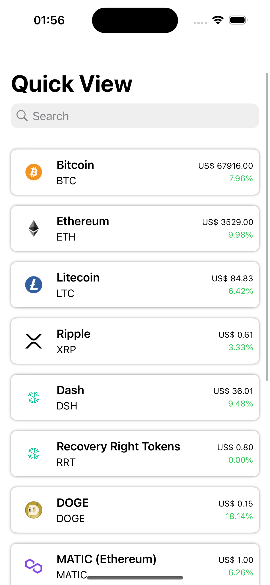
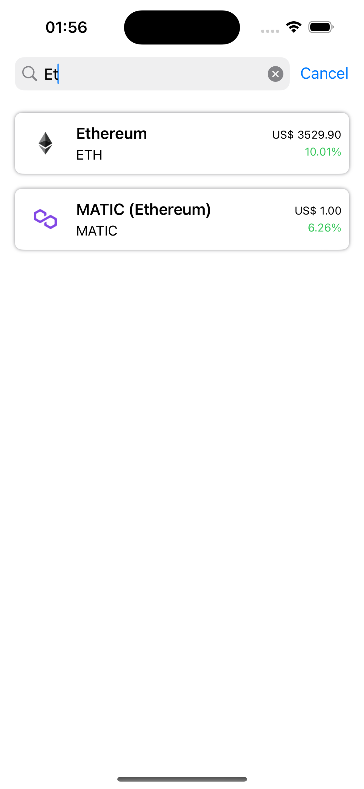

# QuickCryptoView

QuickCryptoView is a simple app that allows you to quickly view the last prices for cryptocurrencies in USD.

## Features

- View last prices for popular cryptocurrencies.
- Simple and intuitive user interface.
- Real-time updates for prices.

## Screenshots

<div style="display: flex; flex-direction: row;">
  
  
</div>

## Installation

To install QuickCryptoViewer, follow these steps:

1. Clone this repository to your local machine.

```bash
git clone https://github.com/leo1mml/QuickCryptoViewer.git
```


2. Open the project in Xcode.

3. Build and run the project on your iOS device or simulator.

## Usage

Simply launch the app, and you'll see the last prices for popular cryptocurrencies displayed on the screen.

